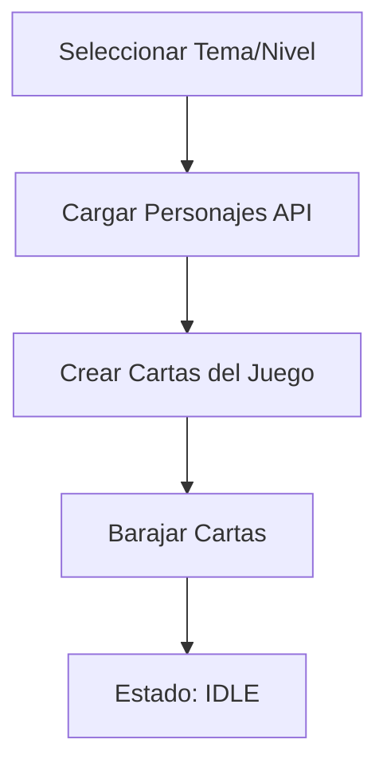
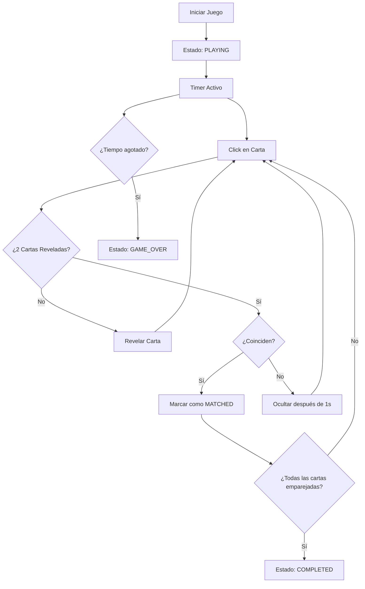

# Game Logic Feature - Arquitectura del Juego de Memoria

## 📋 Resumen

Esta feature implementa la lógica completa del juego de memoria dimensional, incluyendo manejo de estado, mecánicas de juego, sistema de puntuación, timer y persistencia.

## 🏗️ Arquitectura

### Estructura de Archivos

```
src/
├── types/
│   └── game.js                 # Tipos y constantes del juego
├── contexts/
│   └── GameContext.jsx         # Contexto global del estado del juego
├── hooks/
│   ├── useGameLogic.js         # Hook principal de lógica del juego
│   ├── useGameTimer.js         # Hook para manejo del timer
│   └── useGameStats.js         # Hook para estadísticas
├── utils/
│   └── gameUtils.js            # Utilidades y funciones auxiliares
├── components/game/
│   ├── GameBoard.jsx           # Componente principal del tablero
│   ├── GameCard.jsx            # Componente de carta individual
│   ├── GameControls.jsx        # Controles del juego
│   ├── GameTimer.jsx           # Componente del timer
│   ├── GameStats.jsx           # Componente de estadísticas
│   └── GameTest.jsx            # Componente de prueba
└── docs/
    └── GAME_LOGIC.md           # Esta documentación
```

## 🎯 Componentes Principales

### 1. GameContext (Contexto Global)

**Responsabilidad**: Manejo centralizado del estado del juego.

**Estado gestionado**:
- Status del juego (idle, playing, paused, completed, game_over)
- Cartas del tablero y sus estados
- Puntuación y estadísticas
- Timer y tiempo restante
- Configuración del nivel actual

**Acciones disponibles**:
- `initGame()` - Inicializar nuevo juego
- `startGame()` - Comenzar el juego
- `pauseGame()` / `resumeGame()` - Pausar/reanudar
- `revealCard()` - Revelar una carta
- `resetGame()` - Reiniciar juego

### 2. GameLogic Hook

**Responsabilidad**: Orquestar la lógica principal del juego.

**Funcionalidades**:
- Integración con APIs de personajes
- Creación y barajeo de cartas
- Manejo de clicks en cartas
- Detección automática de coincidencias
- Control del flujo del juego

### 3. GameTimer Hook

**Responsabilidad**: Manejo del timer del juego.

**Funcionalidades**:
- Decrementación automática del tiempo
- Estados del timer (normal, warning, critical)
- Formateo del tiempo para display
- Control de pausa/reanudación

### 4. GameStats Hook

**Responsabilidad**: Cálculo y manejo de estadísticas.

**Métricas calculadas**:
- Movimientos realizados
- Precisión (% de aciertos)
- Puntuación con bonificaciones
- Rendimiento general
- Tiempo de juego

## 🎮 Mecánicas del Juego

### Estados de las Cartas

```javascript
CARD_STATES = {
  HIDDEN: 'hidden',       // Carta boca abajo
  REVEALED: 'revealed',   // Carta boca arriba (temporal)
  MATCHED: 'matched',     // Carta emparejada (permanente)
  DISABLED: 'disabled'    // Carta deshabilitada
}
```

### Estados del Juego

```javascript
GAME_STATES = {
  IDLE: 'idle',           // Juego no iniciado
  PLAYING: 'playing',     // Juego en progreso
  PAUSED: 'paused',       // Juego pausado
  COMPLETED: 'completed', // Juego completado exitosamente
  GAME_OVER: 'game_over'  // Tiempo agotado
}
```

### Sistema de Niveles

| Nivel | Pares | Cartas | Tiempo | Dificultad |
|-------|-------|--------|--------|------------|
| 1     | 4     | 8      | 120s   | Principiante |
| 2     | 5     | 10     | 105s   | Fácil |
| 3     | 6     | 12     | 90s    | Intermedio |
| 4     | 7     | 14     | 75s    | Difícil |
| 5     | 8     | 16     | 60s    | Experto |

### Sistema de Puntuación

```javascript
Puntuación = (PuntosBase + BonusTiempo + BonusRacha) × MultiplicadorNivel

Donde:
- PuntosBase = 100 puntos por match
- BonusTiempo = (TiempoRestante / TiempoTotal) × 200
- BonusRacha = PuntosBase × 1.5 × (Racha - 1)
- MultiplicadorNivel = 1.0 a 2.0 según el nivel
```

## 🔄 Flujo del Juego

### 1. Inicialización



### 2. Gameplay



### 3. Detección de Coincidencias

El sistema detecta automáticamente cuando se revelan 2 cartas:

1. **Match encontrado**: Las cartas se marcan como `MATCHED` después de 500ms
2. **No match**: Las cartas se ocultan después de 1000ms
3. **Racha**: Se incrementa en matches consecutivos, se resetea en fallos

## 🎨 Componentes UI

### GameBoard

Componente principal que orquesta toda la interfaz:
- Renderiza el grid de cartas
- Muestra timer y estadísticas
- Maneja estados de finalización
- Controla la responsividad del layout

### GameCard

Componente de carta individual:
- Animaciones de flip y hover
- Estados visuales diferenciados
- Accesibilidad (ARIA labels, keyboard navigation)
- Manejo de errores de imágenes

### GameControls

Controles dinámicos del juego:
- Botones contextuales según el estado
- Indicadores visuales de estado
- Acciones de inicio, pausa y reinicio

### GameTimer

Timer visual con alertas:
- Barra de progreso del tiempo
- Estados de advertencia (warning/critical)
- Animaciones para estados críticos

### GameStats

Panel de estadísticas en tiempo real:
- Métricas básicas (movimientos, pares, puntos)
- Rating de rendimiento con estrellas
- Información detallada expandible

## 🔧 Utilidades

### gameUtils.js

Funciones auxiliares para la lógica del juego:

- `shuffleArray()` - Algoritmo Fisher-Yates para barajeo
- `createGameCards()` - Creación de cartas a partir de personajes
- `areCardsMatching()` - Verificación de coincidencias
- `calculateGameProgress()` - Cálculo de progreso
- `formatTime()` - Formateo de tiempo MM:SS
- `generateGameStats()` - Generación de estadísticas
- `saveGameState()` / `loadGameState()` - Persistencia en localStorage

## 💾 Persistencia

### localStorage

El juego guarda automáticamente:
- Estado actual del juego (cada 30 segundos durante partida activa)
- Configuración de nivel y tema
- Progreso de la partida

### Limpieza automática

El estado guardado se limpia cuando:
- El juego se completa exitosamente
- Se agota el tiempo (game over)
- Se inicia un nuevo juego

## 🧪 Testing

### GameTest Component

Componente de prueba que incluye:
- Selector de temas y niveles
- Información de configuración del nivel
- Lista de funcionalidades a probar
- Instrucciones detalladas de testing

### Casos de Prueba Recomendados

1. **Carga de datos**: Probar todos los temas y niveles
2. **Mecánicas básicas**: Revelar cartas, encontrar matches
3. **Timer**: Verificar decrementación y estados de alerta
4. **Pausa/Reanudación**: Comprobar que el timer se detiene
5. **Finalización**: Completar juego y agotar tiempo
6. **Estadísticas**: Verificar cálculos de puntuación y métricas
7. **Persistencia**: Recargar página durante partida activa

## 🚀 Próximas Mejoras

### Funcionalidades Futuras

- **Modo multijugador**: Competencia en tiempo real
- **Logros**: Sistema de achievements
- **Leaderboards**: Tabla de mejores puntuaciones
- **Efectos de sonido**: Feedback auditivo
- **Animaciones avanzadas**: Transiciones más fluidas
- **Modo offline**: Juego sin conexión
- **Personalización**: Temas y fondos personalizados

### Optimizaciones Técnicas

- **Memoización**: Optimizar re-renders con React.memo
- **Lazy loading**: Cargar componentes bajo demanda
- **Service Worker**: Cache de recursos estáticos
- **Bundle splitting**: Separar código por features
- **Performance monitoring**: Métricas de rendimiento

## 📚 Dependencias

### Internas
- `useGameCharacters` - Hook de integración con APIs
- `THEMES` - Constantes de temas de character.js
- `QueryClient` - Cliente de TanStack Query

### Externas
- React 18+ (Hooks, Context)
- TailwindCSS (Estilos)
- TanStack Query (Cache y estado servidor)

## 🔗 Integración

Esta feature se integra con:
- **API Integration**: Consume personajes normalizados
- **Home Page**: Se accede desde la selección de tema
- **Level System**: Utiliza configuración de niveles
- **Timer System**: Implementa decrementación por nivel

La arquitectura está diseñada para ser modular y extensible, permitiendo futuras mejoras sin afectar el código existente.
